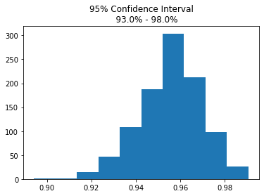
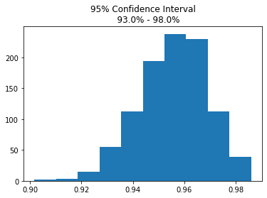

# Pipeline

Today we will make a simple pipeline, and then run a Grid Search!

Import packages and data:


```python
import pandas as pd
import numpy as np
from sklearn.datasets import load_breast_cancer
from sklearn.ensemble import RandomForestClassifier
from sklearn.model_selection  import train_test_split, cross_val_score, GridSearchCV
from sklearn.preprocessing import StandardScaler
from sklearn.pipeline import make_pipeline
import matplotlib.pyplot as plt

data = load_breast_cancer()
df = pd.DataFrame(data['data'],  columns =  data['feature_names'])
df['target'] =  data['target']
```


```python
# __SOLUTION__
import pandas as pd
import numpy as np
from sklearn.datasets import load_breast_cancer
from sklearn.ensemble import RandomForestClassifier
from sklearn.model_selection  import train_test_split, cross_val_score, GridSearchCV
from sklearn.preprocessing import StandardScaler
from sklearn.pipeline import make_pipeline
import matplotlib.pyplot as plt

data = load_breast_cancer()
df = pd.DataFrame(data['data'],  columns =  data['feature_names'])
df['target'] =  data['target']
```

**Create a train test split of the dataset**
>Set `random_state`  to 2020


```python
X = df.drop('target', axis = 1)
y = df.target
X_train, X_test, y_train, y_test = train_test_split(X,y, random_state=2020)
```


```python
# __SOLUTION__
X = df.drop('target', axis = 1)
y = df.target
X_train, X_test, y_train, y_test = train_test_split(X,y, random_state=2020)
```

**Create a pipeline containing a StandardScaler object and RandomForestClassifier**


```python

```


```python
# __SOLUTION__
pipeline = make_pipeline(StandardScaler(), RandomForestClassifier(random_state=2020))
```

**Evaluate the pipeline**


```python

```


```python
# __SOLUTION__
cross_val_score(pipeline, X_train, y_train)
```


    array([0.96511628, 0.97647059, 0.89411765, 0.95294118, 0.97647059])


**Let's take a look at what parameters we can use in a grid search**

Below, we use the `.get_params()` method to output all of the possible parameters in a pipeline.


```python
pipeline.get_params()
```


```python
# __SOLUTION__
pipeline.get_params()
```


    {'memory': None,
     'steps': [('standardscaler', StandardScaler()),
      ('randomforestclassifier', RandomForestClassifier(random_state=2020))],
     'verbose': False,
     'standardscaler': StandardScaler(),
     'randomforestclassifier': RandomForestClassifier(random_state=2020),
     'standardscaler__copy': True,
     'standardscaler__with_mean': True,
     'standardscaler__with_std': True,
     'randomforestclassifier__bootstrap': True,
     'randomforestclassifier__ccp_alpha': 0.0,
     'randomforestclassifier__class_weight': None,
     'randomforestclassifier__criterion': 'gini',
     'randomforestclassifier__max_depth': None,
     'randomforestclassifier__max_features': 'auto',
     'randomforestclassifier__max_leaf_nodes': None,
     'randomforestclassifier__max_samples': None,
     'randomforestclassifier__min_impurity_decrease': 0.0,
     'randomforestclassifier__min_impurity_split': None,
     'randomforestclassifier__min_samples_leaf': 1,
     'randomforestclassifier__min_samples_split': 2,
     'randomforestclassifier__min_weight_fraction_leaf': 0.0,
     'randomforestclassifier__n_estimators': 100,
     'randomforestclassifier__n_jobs': None,
     'randomforestclassifier__oob_score': False,
     'randomforestclassifier__random_state': 2020,
     'randomforestclassifier__verbose': 0,
     'randomforestclassifier__warm_start': False}


The thing to focus on in the dictionary above are the words following the double underscore `__`. 

Those words are the *actual* name of the parameter which you can use to reference the model's documentation!

Once we have selected parameters to tune, we can add them to a dictionary as keys, with a list of settings we would like to try as the values.


```python
params = {'randomforestclassifier__max_depth': [3,5,10],
          'randomforestclassifier__max_features': [3,9,12,15],
          'randomforestclassifier__min_samples_leaf': [2,5,10]}
```


```python
# __SOLUTION__
params = {'randomforestclassifier__max_depth': [3,5,10],
          'randomforestclassifier__max_features': [3,9,12,15],
          'randomforestclassifier__min_samples_leaf': [2,5,10]}
```

Now, we can feed in the pipeline and the parameters we'd like to search.

Then we fit the gridsearch pipeline to the training data.


```python
grid_pipe = GridSearchCV(pipeline,params)
grid_pipe.fit(X_train, y_train)
```


```python
# __SOLUTION__
grid_pipe = GridSearchCV(pipeline,params)
grid_pipe.fit(X_train, y_train)
```


    GridSearchCV(estimator=Pipeline(steps=[('standardscaler', StandardScaler()),
                                           ('randomforestclassifier',
                                            RandomForestClassifier(random_state=2020))]),
                 param_grid={'randomforestclassifier__max_depth': [3, 5, 10],
                             'randomforestclassifier__max_features': [3, 9, 12, 15],
                             'randomforestclassifier__min_samples_leaf': [2, 5,
                                                                          10]})


Once the grid search has completed, we can take a look at the best performing model!


```python
grid_pipe.best_estimator_
```


```python
# __SOLUTION__
grid_pipe.best_estimator_
```


    Pipeline(steps=[('standardscaler', StandardScaler()),
                    ('randomforestclassifier',
                     RandomForestClassifier(max_depth=10, max_features=3,
                                            min_samples_leaf=2,
                                            random_state=2020))])


We can save the best estimator to a variable and then evaluate like normal!


```python
final_pipe = grid_pipe.best_estimator_
```


```python
# __SOLUTION__
final_pipe = grid_pipe.best_estimator_
```


```python
cross_val_score(final_pipe, X_train, y_train)
```


```python
# __SOLUTION__
cross_val_score(final_pipe, X_train, y_train)
```


    array([0.96511628, 0.97647059, 0.91764706, 0.95294118, 0.97647059])


**What do you think? Should we choose the first pipeline or the gridsearched pipeline?**

After you have selected a final model, fit the model on all of the training data and evalutate the model's performance on the testing data.


```python

```


```python
# __SOLUTION__
'''
I choose the gridsearched pipeline because it performs slightly better than the first pipeline, 
and performs similarly across 5 fold validation.
'''

final_pipe.fit(X_train, y_train)
```


    Pipeline(steps=[('standardscaler', StandardScaler()),
                    ('randomforestclassifier',
                     RandomForestClassifier(max_depth=10, max_features=3,
                                            min_samples_leaf=2,
                                            random_state=2020))])


```python

```


```python
# __SOLUTION__
final_pipe.score(X_test, y_test)
```


    0.965034965034965


```python
# __SOLUTION__
'''This random forest model performs with approximately 97% accuracy on out of sample data. 
This accuracy aligns with the average 5 fold cross validated score on in-sample data, and offers 
sufficient evidence that this model is able to make accurate prediction on unseen data.'''
```


    'This random forest model performs with approximately 97% accuracy on out of sample data. \nThis accuracy aligns with the average 5 fold cross validated score on in-sample data, and offers \nsufficient evidence that this model is able to make accurate prediction on unseen data.'


# Bootstrap Evaluation
What if we wanted to infer the range for this model's average accuracy?

We can do this via bootstrap resampling.


```python
def bootstrap_model(model, X, y, iterations = 1000):
    scores = []
    for i in range(iterations):
        # Collect a random sample of data with replacement
        X_train = X.sample(n=len(X), replace=True)
        # Collect the matching target labels for the randomly samples observations
        y_train = y.loc[[x for x in X_train.index]]
        # Create a testing set made up of observations that were not randomly sampled
        X_test = X.loc[[x for x in X.index if x not in X_train.index]]
        # Collect matching target labels
        y_test = y.loc[[x for x in X_test.index]]
        # Fit model on randomly sampled data
        model.fit(X_train, y_train)
        # Score fit model on out of sample data
        score = model.score(X_test, y_test)
        # Append scores to a list
        scores.append(score)
    
    # We can use the empirical rule 
    # to identify the range of accuracy 
    # that contains 95% of the produced scores
    confidence = 0.95
    lower_percentile = ((1-confidence)/2) * 100
    upper_percentile = (confidence+((1-confidence)/2)) * 100
    lower = np.percentile(scores, lower_percentile)
    upper = np.percentile(scores, upper_percentile)
    plt.hist(scores)
    # Create confidence interval title 
    ci = f'{int(confidence*100)}% Confidence Interval\n\
    {np.round(lower, decimals=2)*100}% - {np.round(upper, decimals=2)*100}%'
    plt.title(ci)
    plt.show()
    return confidence, lower, upper
```


```python
# __SOLUTION__
def bootstrap_model(model, X, y, iterations = 1000):
    scores = []
    for i in range(iterations):
        # Collect a random sample of data with replacement
        X_train = X.sample(n=len(X), replace=True)
        # Collect the matching target labels for the randomly samples observations
        y_train = y.loc[[x for x in X_train.index]]
        # Create a testing set made up of observations that were not randomly sampled
        X_test = X.loc[[x for x in X.index if x not in X_train.index]]
        # Collect matching target labels
        y_test = y.loc[[x for x in X_test.index]]
        # Fit model on randomly sampled data
        model.fit(X_train, y_train)
        # Score fit model on out of sample data
        score = model.score(X_test, y_test)
        # Append scores to a list
        scores.append(score)
    
    # We can use the empirical rule 
    # to identify the range of accuracy 
    # that contains 95% of the produced scores
    confidence = 0.95
    lower_percentile = ((1-confidence)/2) * 100
    upper_percentile = (confidence+((1-confidence)/2)) * 100
    lower = np.percentile(scores, lower_percentile)
    upper = np.percentile(scores, upper_percentile)
    plt.hist(scores)
    # Create confidence interval title 
    ci = f'{int(confidence*100)}% Confidence Interval\n\
    {np.round(lower, decimals=2)*100}% - {np.round(upper, decimals=2)*100}%'
    plt.title(ci)
    plt.show()
    return confidence, lower, upper
```


```python
# This code will take a while to run!
alpha, lower, upper = bootstrap_model(final_pipe, X, y)
```





```python
# __SOLUTION__
# This code willl take a while to run!
alpha, lower, upper = bootstrap_model(final_pipe, X, y)
```





```python

```
